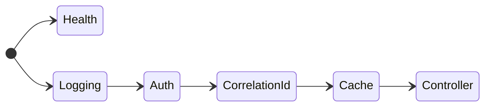

## Notes

### Startup
The application does not exit when an error is throw, instead it will throw and error by disabling `abortOnError`

### Rate limiting

Rate limiting has been added to prevent brute force attacks on the gateway

### TODO:
```
[ ]: Elastic logging
[-]: Redis Cache
[x]: Correlation Id middleware
[x]: Logging middleware
[ ]: Model validation
[ ]: Health checks
[X]: Proxy
```

### Middleware order




